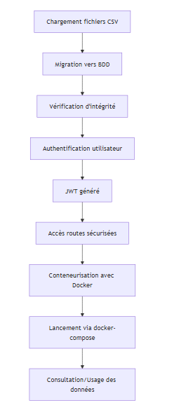
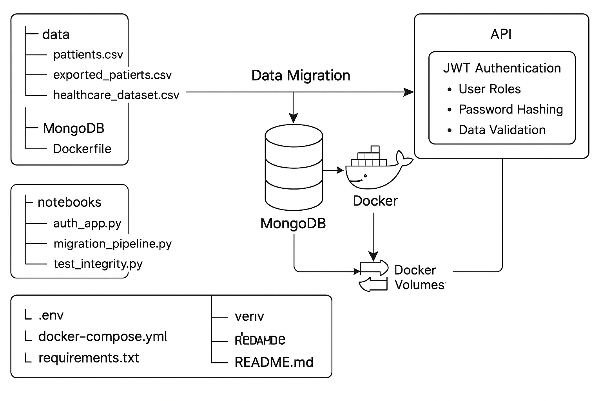
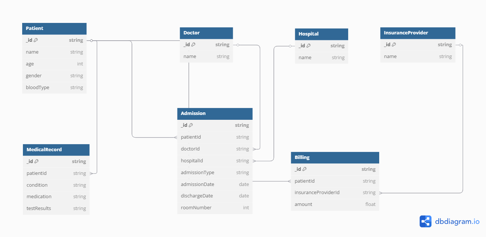

# Migrez des données médicales à l’aide du NoSQL

## Objectif

Ce projet vise à :

- Migrer des données de patients depuis des fichiers .csv vers une base NoSQL (MongoDB),

- Implémenter une API sécurisée avec authentification (JWT) et rôles utilisateurs (user, admin),

- Assurer le hachage sécurisé des mots de passe avec bcrypt,

- Valider la cohérence des données via des scripts de test,

- Gérer les dépendances avec requirements.txt,

- Conteneuriser toute l’architecture avec Docker pour faciliter le déploiement,

- Assurer la persistance des données avec des volumes Docker.

## Stack utilisée

- Back-end : Python (FastAPI ou Flask)

- BDD NoSQL : MongoDB

- Migration : script python

- Volumes Docker : pour persistance

- Authentification : JWT

- Sécurité : Bcrypt pour le hachage des mots de passe

- Gestion des rôles : user, admin

##  Structure du projet

 **Eléments principaux de l'architecture du projet**

1- Sources de données

- Fichiers CSV (patients.csv, healthcare_dataset.csv…)

2- Pipeline de migration

- Script migration_pipeline.py

- Traitement : lecture → transformation → validation → insertion MongoDB

3- Base de données MongoDB

- Stockage persistant des données via volume Docker

4- Tests d’intégrité

- Script test_integrity.py pour valider la qualité des données insérées

5- API sécurisée

- Script auth_app.py

- Authentification avec JWT

- Rôles utilisateurs (user / admin)

- Mots de passe hachés avec bcrypt

6- Conteneurisation avec Docker

- Services définis dans docker-compose.yml

- Dockerfile pour l’image de l’app

- Fichiers .env et requirements.txt pour la config

7- Orchestration et exécution

- Lancement de tous les composants avec docker-compose up

## Lancer le projet avec Docker

1- Construire et lancer les conteneurs :

`docker-compose up --build`

2- Accéder au conteneur :

docker exec -it <nom_conteneur_api> bash

3- Exécuter les scripts à la main (si nécessaire) :

`python notebooks/migration_pipeline.py`

`python notebooks/auth_app.py`

## Authentification

- Utilise JWT pour protéger les routes.

- Route /login pour s’authentifier et obtenir un token.

- Ajoute le token dans les headers Authorization: Bearer <token> pour accéder aux routes protégées.

## Hachage des mots de passe

- Utilisation de bcrypt :

- Lors de l’inscription : mot de passe haché avant insertion en base.

- Lors du login : mot de passe comparé avec bcrypt.compare().

## Tests d'intégrité

Script :

`notebooks/test_integrity.py`

- Vérifie que les données migrées conservent leur structure et contenu.

- Peut être exécuté dans le conteneur ou en local : 

`python notebooks/test_integrity.py`

## Volumes Docker

volumes:
  mongodb_data:

- Assurent la persistance des données MongoDB après redémarrage.

## Schéma BDD

## Contrôle d’accès

**Route	  ||  Rôle requis**

/admin/*  ||  admin

/user/*	 ||    user, admin

## Dépendances principales

Ce projet repose sur plusieurs bibliothèques clés, groupées par fonctionnalités :

**API & Serveur**
- `fastapi` : framework rapide et moderne pour créer des APIs REST.
- `uvicorn` : serveur léger ASGI pour exécuter l'application FastAPI.

**Authentification & Sécurité**
- `python-jose` : gestion des tokens JWT pour sécuriser les routes.
- `bcrypt` : hachage sécurisé des mots de passe.
- `passlib` : abstraction de hachage compatible avec `bcrypt`.

**Base de données MongoDB**
- `pymongo` : interaction avec la base de données MongoDB.
- `dnspython` : support des connexions Mongo Atlas (si utilisé).

**Traitement de données**
- `pandas` : lecture et transformation des fichiers CSV.
- `numpy` : support mathématique pour les traitements de données.
- `python-dateutil`, `pytz`, `tzdata` : gestion avancée des dates et fuseaux horaires.

**Tests**
- `pytest` : exécution des tests d'intégrité et fonctionnels.

**Utilitaires**
- `python-dotenv` : chargement des variables d'environnement depuis un fichier `.env`.
- `pydantic` : validation des schémas de données (modèles FastAPI).
- `typing-extensions`, `annotated-types` : compatibilité avec les types avancés.

---

**Installation des dépendances**

Installe toutes les dépendances en une seule commande :

`pip install -r requirements.txt`

# 👤 Owner
<h1 align="center">Hi 👋, I'm khalid</h1>
<h3 align="center">Data analyst & Data engineer || Power BI and Qlik sense developer</h3>

-  All of my projects are available at [https://github.com/lidoni?tab=repositories](https://github.com/lidoni?tab=repositories)

- You can see my presentations in my linkedin posts [https://www.linkedin.com/in/khalid-ouro-adoyi/](https://www.linkedin.com/in/khalid-ouro-adoyi/)

-  How to reach me **khalidouroadoyi@gmail.com**

<h3 align="left">Languages and Tools:</h3>

 

  
  
  
  
  
  
   

  
  
 
  
  
  
  
   

  
  
  
  

Data Analyst & Data Engineer 

Email : khalidouroadoyi@gmail.com
[LinkedIn](https://www.linkedin.com/in/khalid-ouro-adoyi/) | [GitHub](https://github.com/LIDONI)
) | [GitHub](https://github.com/LIDONI)
